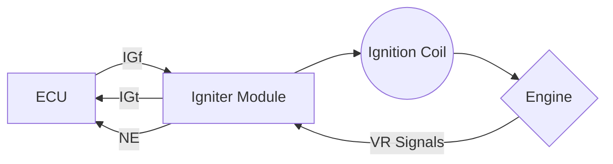

# Igniter Module for Toyota VAST Engines

Hi there! This is a repository first for the 22RE igniter module, and eventually most Toyota VAST igniters. It is currently a work in progress.

# What is VAST?

VAST stands for variable advance spark timing system. It's the system Toyota uses on a ton of their older vehicles. 

## How does it work?

Here's a **very generalized** diagram to get a better idea of how the system works:

## Know the flow

The way that everything ties together is fairly simple:

- At startup, the igniter assumes a locked timing. This is stated in the manual for each engine.
- The VR signal is sent to the igniter.
  - The signal is converted from a sine to a square wave by the igniter (NE).
  - NE is used to reference the spark timing for the igniter.
  - NE is also sent to the ECU for spark timing reference.
 - The ECU begins sending the IGt (Ignition Time) signal to the igniter
   - The igniter uses the **FALLING EDGE** of this signal to trigger the coil.
   - The igniter **STILL CONTROLS DWELL**. 
   - The style of signal depends on year, make and model.
 - The ECU expects to receive the IGf (Ignition Fired) signal from the igniter.
   - If the ECU does not receive this signal it will assume locked timing and issue a CEL.
   - The style of signal depends on year, make and model. 
   - This is the critical signal that blocks most ignition coil swaps.
   - The igniter can disable this signal to signify ignition issues like a bad coil. 
 - The ECU receives the signal
   - Once the signal is received within a certain time, the ECU will assume all is good.
   - The engine will run with no trouble codes as long as the timing is correct.

## Spoofing our signal

If you roam around forums long enough, you'll find that many people have figured out a way to spoof this signal. This just involves tying the IGt signal to a diode and transistor. This generates our "spoofed" IGf signal.

While this can and does work, it's not the best option. We are losing a lot of capability, and you will still need some type of module to control the coils. 

There is a better way!

## Recreating our signal

There are two main ways that our IGf signal is generated:

1. Use the overvoltage on the primary side of the coil to trigger a multivibrator that creates our signal **after** IGt.
2. Use the current through the coil to create a ramped signal **during** IGt. 

Then in the middle of all of this is our checking scheme. Failing coils won't have enough overvoltage or won't flow enough current quick enough. So ideally when our coils are failing we stop sending the IGf signal to tell the ECU to trip a CEL. 

We can create our signal using analog "dumb" logic or we can use a microcontroller for "smart" logic. Smart logic will be easier for creating a more universal module that will work with more models and allow for some tweaking.
 
## Other Options

There are some other options if your igniter fails:

- Spend $300+ on a used module from eBay or a forum member.
- Spend $500+ on an NOS module if you can find it, or import one.
- Delete the igniter system with something similar. This is only possible on some systems (22R).
- Replace the entire ECU with another that does not need IGf.
- Find an igniter delete module. This is only available for certain models and years.

# Creating our new module

Our new module will hopefully maintain original capability and add on some new capabilities as well.

The easiest way to describe creating the module is to divide up each of our signals.

## NE Signal 

Our NE signal is pretty easy to generate! For my module I am using a MAX9924 following an identical scheme to the Speeduino MAX9926 module.

You can also generate the NE signal using GM HEI modules or other off the shelf modules. There are lots of options for us here!

## IGt Signal

Our IGt signal designates when our coil will fire. From most of the information I can find, it **DOES NOT** control the dwell of the coil. So all we need to do is use the signals falling edge to control the fire point. 

I will talk about dwell control later...

## IGf Signal

The IGf signal is the critical signal here. We can:
- Use a multivibrator or microcontroller to give the ECU the duty cycle it wants when the signal **FOLLOWS  AFTER** the IGt signal.
- Use a shunt resistor to measure the current through the coil then deliver the signal to the ECU. There will be certain scaling needs to get the correct signal it wants. This is when it wants the signal **DURING** the IGt signal.

## Dwell Control

Dwell control is our final piece here. The igniter always appears to control the dwell, so unless we have an external module, we will need to control it. 

The simplest way is to depend on an IGBT controller or similar logic to begin charging and holding the current immediately after or a certain amount of time after the last spark. This is going to generate a lot of excess heat even with a current hold feature and will decrease the life on our module and coil. 

The smart way is to calculate RPM, guess when our next spark event will be, then begin charging a certain time before we expect our IGt signal. This is the best way since we will hopefully be within a few microseconds of our expected fire point and we can charge accordingly. If we use the coil current as well then we allocate extra time if our coils are taking longer than expected. There's other things we can do here too!

# Current Progress

Currently we are on the second version of the module. I will be keeping any older versions on this repo for reference, but do not encourage anyone to try building them until they are completely vetted. 

**BUILD AT YOUR OWN RISK**

## V1

V1 went about generating the IGf signal by building the circuit with only analog and passive components. It was simulated in LTSpice to verify ideal behavior before real life testing. 

While the circuit does work, it didn't yield the performance I wanted. It's also exclusive to the 53EX igniter module for the 22RTE, so it's not the best to be developing as a universal module.

## V2

V2 is instead intended to be changed and modified for as many igniter modules as possible: 
- It uses an ATTINY841 chip to do all of our calculations and logic. 
- It is mostly chosen for ease of use and 5V logic, there are buffers as well for output protection.
- The IGBT is controlled through a FAN1100 Ignition IGBT controller. This is much easier than a custom control scheme and relieves processing from our MCU.
- Currently has an analog switch to swap between using NE and the MCU for IGBT control. This is a failsafe but there may be a better way to go about it.
- Each chunk is made to be modular. If someone needs 3 more outputs then they can multiple the output circuit 3 more times and use a similar MCU. 

Overall this is still a work in progress. My ECU and original Igniter are out for repair and testing, so I am unable to verify the new design until I get them back.
